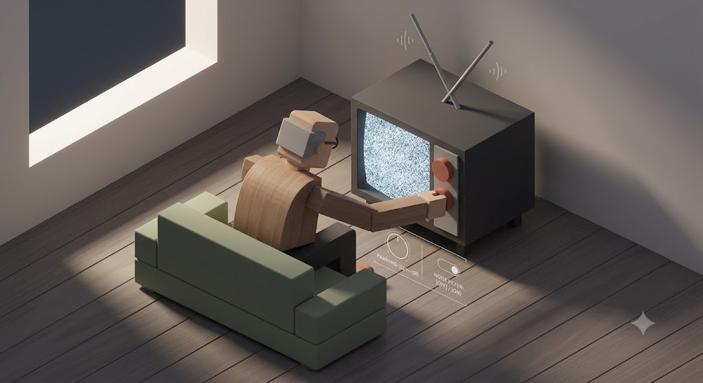

# 01: Evening News

### 🎯 The Hook
* **Core Loop:** The player interacts with 3D UI controls to manipulate audio panning and frequency filters, stripping away thick, harsh static to cleanly tune into a hidden television transmission.
* **Aesthetic/Vibe:** Late-night analog isolation. A warm, glowing CRT screen sitting in a dark room, focusing heavily on tactile hardware feedback and atmospheric tension.

### 🎬 The Payoff
* **The Hook-Execution:** The high-friction noise floor smoothly melts away into a crystal-clear, stable audio stream, providing a highly satisfying sensory transition the moment the signal aligns.
* **The Exit State:** Once the transmission is perfectly resolved, a clean exit handshake path opens up, allowing a seamless drop back into the GameLauncher interface.

### 🛠️ The Tech Drill (Underlying Lessons)
* **Engine Target:** Godot 4.x
* **Subsystem A (Audio Server DSP):** Real-time audio bus manipulation using built-in Godot effects. Dynamically modulating an `AudioEffectAmplify` (for noise floor mapping), an `AudioEffectBandPassFilter`, and an `AudioEffectPanner` tied directly to the physical rotation calculations of the 3D knobs.
* **Subsystem B (State Validation Gates):** Building a strict data-separation layer where gameplay parameters are determined in a configuration menu *prior* to entering the world state, preventing players from brute-forcing the solution via real-time scrubbing.
* **Subsystem C (Blender-to-Engine Pipeline):** Working through a clean `.gltf`/`.glb` material derivation export loop from Blender into Godot 4, establishing a reusable workflow for high-end static mesh assets.

## 🚀 MVP Scope (Phase 1)
* **Core Focus:** 100% of the initial velocity goes into the Audio Server DSP routing, the pre-set initialization logic, and the viewport/raycast input interaction.
* **Static Presentation:** All environmental and character meshes (the CRT TV, the room layout) will remain static, un-rigged assets exported from Blender to keep the initial build completely un-bloated.
* **Single Matrix Loop:** The module launches with exactly one distinct frequency-and-panning coordinate set to solve.

---

## 📡 Future Expansions (Backlog)
If this kata is revisited to layer on advanced engine subsystems, the architectural upgrade path is:
* **Phase 2 (Animation Pipeline):** Replace the static environment with a fully rigged character model, using Godot’s `AnimationPlayer` or Blend Trees to trigger physical reactions as the TV signal clears up.
* **Phase 3 (Dynamic Scaling):** Shift from a single static coordinate set to a procedural or multi-tier puzzle generation system with progressive signal degradation.
* **Phase 4 (Physicalized UI):** Swap basic raycast clicking for full physics-based knob twisting or rigid-body interactions.