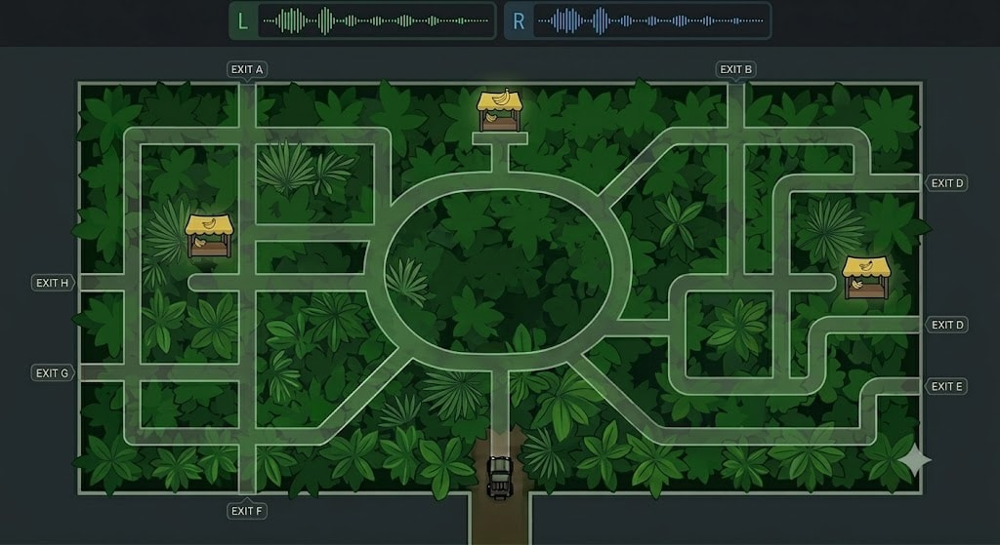

# 02: Under Ceiba Canopy

### 🎯 The Hook
* **Core Loop:** A tiny 2D car drives into a labyrinthine forest from the bottom of the screen and completely vanishes beneath a dense canopy overlay. The car executes an autonomous route. The player must listen intently to the real-time audio telemetry—interpreting engine revs for acceleration and stereo panning for turns—to mentally trace the vehicle's path.
* **Aesthetic/Vibe:** High-contrast 2D minimalist map layout. A lush, opaque green forest canopy completely obscuring the grid below, paired with crisp, highly responsive stereo sound design.
* **The Victory Condition:** Once the audio stops, the player is presented with the map and must accurately mark which of the multiple exits (or sequence of checkpoints) the car successfully reached based purely on their acoustic tracking.

### 🎬 The Payoff
* **The Hook-Execution:** Clicking the suspected exit reveals the hidden path the car actually took. Watching your mental audio map perfectly align with the actual 2D trajectory provides a massive "audio-detective" breakthrough moment.
* **The Exit State:** Successfully identifying the route unlocks a clean handshake path to exit the module and return to the primary GameLauncher interface.

### 🛠️ The Tech Drill (Underlying Lessons)
* **Engine Target:** Godot 4.x
* **Subsystem A (Autonomous 2D Path Execution):** Setting up a simple path-following system (`Path2D` / `PathFollow2D`) for the invisible vehicle to execute varied, pre-baked routes across the labyrinth matrix seamlessly.
* **Subsystem B (Telemetry-to-Audio Mapping):** Translating raw 2D physics properties into distinct sound states. The car’s angular velocity drives immediate `AudioStreamPlayer2D` stereo panning, while linear velocity maps directly to the pitch and RPM modulation of the engine audio loop.
* **Subsystem C (Interactive Verification UI):** Building a 2D input overlay phase. Once the vehicle finishes its run, the engine locks gameplay physics and activates UI `TextureButtons` over the maze exits, capturing player clicks and comparing them against the vehicle's final `global_position`.

### 🏋️ Gym (optional dev station)

* **Gym verdict:** yes
* **Stations:**
  * **Path replay** — Subsystem A: car follows a baked `Path2D` with canopy hidden; verify routes and timing.
  * **Audio telemetry** — Subsystem B: same autonomous run with canopy on; tune velocity→pitch/pan mapping without guess UI.
  * **Guess UI** — Subsystem C: frozen maze, exit buttons only; feed a known end position to test validation logic.
* **Gym rules:** Stations may run separately; no full listen-and-mark loop required until the level.

### 🎮 Level (Phase 1 MVP)

* **Level scope:** Full audio-detective loop — occluded run, then mark the exit, then reveal path.
* **Uses gym work:** Path execution, telemetry mapping, and verification UI composed under canopy occlusion.

* **Core Focus:** One fixed rectangular canopy maze, 3 distinct hidden paths, and the listen-and-mark validation UI.
* **Pure Audio Observation:** Zero player driving during the run phase.
* **Static Layering:** Canopy as a high-Z tilemap or sprite layer for full visual occlusion.

### 🚧 Scope Gates

* **Gate 1:** No player steering during the autonomous run.
* **Gate 2:** No path-draw reconstruction (single exit pick only).
* **Gate 3:** Hand-crafted paths only — no procedural generation.

---

## 📡 Future Expansions (Backlog)
If this prototype is scaled up in the future, the expansion roadmap is:
* **Phase 2 (Path Draw Reconstruction):** Instead of just clicking a single exit button, the player uses a mouse/line tool to actively draw the entire speculated path across checkpoints before validation.
* **Phase 3 (Surface Accents):** Adding localized ground tile hazards (e.g., mud patches that drop speed and spike engine pitch, or gravel that triggers a distinct tire friction loop) to give the player more environmental anchors.
* **Phase 4 (Procedural Path Generation):** Moving from hand-crafted paths to an algorithm that hooks into Godot's A* grid navigation, generating random routes on the fly for infinite replayability.