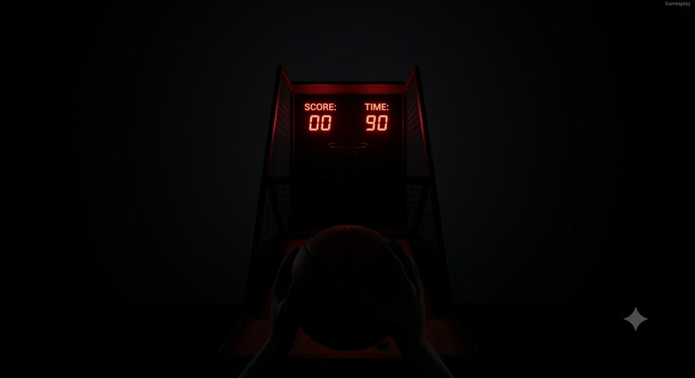

# 03: Cathode Afterglow

### 🎯 The Hook
* **Core Loop:** A 3D first-person arcade basketball shooter where visual tracking is heavily compromised. The hoop, rim, and ball trajectory are obscured by deep shadows, catching only faint, unreliable reflections from the bleeding neon scoreboard. Because sight alone isn't enough to accurately judge distance or angles, the player must rely on detailed 3D spatial audio collision cues to decode their misses and calibrate their throwing vectors.
* **Aesthetic/Vibe:** Heavy atmospheric darkness. The sole light source is the intense, bleeding red glow of the arcade machine's common-cathode digital LED seven-segment scoreboard display (`SCORE: 00` / `TIME: 90`). A faint silhouette of the player's hands holding a ball in the immediate foreground provides the only spatial anchor.
* **The Victory Condition:** Rack up the highest score possible before the strict 90-second match timer runs out. Success relies entirely on your ability to process acoustic feedback and adjust your physics throw vectors.

---

### 🎬 The Payoff
* **The Hook-Execution:** The gameplay loop flips standard muscle memory on its head. Instead of visual tracking, the player forms an intimate mental layout of the 3D space purely through acoustic translation. Hearing an initial sequence of chaotic wall bounces gradually transform into a crisp, centered, repeating net swish purely through incremental mouse adjustments delivers an incredible mechanical validation high.
* **The Exit State:** Reaching the 90-second limit freezes the game state, saves the high score data structure to the launcher repository, and reveals a minimalist glowing UI pathway back to the main `GameLauncher` console.

### 🛠️ The Tech Drill (Underlying Lessons)
* **Engine Target:** Godot 4.x
* **Subsystem A (Physics Interpolation & Input Mapping):** Capturing mouse drag-and-release deltas via `_unhandled_input` to compute dynamic 3D directional vector impulses (`Vector3`). Applying those forces cleanly to a physicalized `RigidBody3D` sphere node with custom `PhysicsMaterial` parameters to control bounce restitution.
* **Subsystem B (Spatial Audio Collision Matrix):** Setting up distinct `Area3D` detection zones on hidden static colliders (Backboard, Metallic Rim, Nylon Net, Environment Floor). Mapping these boundaries to individual `AudioStreamPlayer3D` emitters playing material-specific, high-fidelity audio samples. The engine utilizes Godot's built-in distance attenuation and panning models to translate missed shots into precise structural data.
* **Subsystem C (Session Control & State Management):** Creating an ironclad 90-second game loop manager using a standard asynchronous state machine. This manages transitions cleanly between the pre-game idle state, active match ticking, score increments, and the end-of-session interaction freeze.

## 🚀 MVP Scope (Phase 1)
* **Core Focus:** Establishing a rock-solid 3D physics throwing sandbox, configuring perfect spatial acoustics for 4 core collision types (backboard thud, rim ping, net swish, floor roll), and writing the 90-second timer/score tracking engine.
* **Visual Isolation:** The 3D environment layout is built using primitive geometric shapes with zero advanced texturing. The environment is kept heavily shadowed, relying primarily on an active `OmniLight3D` or `SpotLight3D` component embedded within a 3D Text or Sprite3D node representing the glowing red LED scoreboard to cast faint, low-intensity specular reflections across nearby target geometries.

---

## 📡 Future Expansions (Backlog)
If this prototype is scaled up in the future, the expansion roadmap is:
* **Phase 2 (Dynamic Ball Weights):** Introducing minor mechanical variances to the balls spawned (e.g., heavy leather balls vs. lightweight rubber balls), altering their mass and bounce physics, forcing the player to instantly recalibrate their auditory map based on the weight of the bounce sound.
* **Phase 3 (Acoustic Echo Profiles):** Implementing global audio bus modifications, like dynamic reverb nodes or low-pass filters that change based on where the player stands in the theater foyer, changing the acoustics if they step closer or further back from the cabinet.
* **Phase 4 (The Buzzing Sign):** Adding a physicalized neon/cathode light element on the side of the machine that occasionally flickers or sputters on a randomized timer matrix, momentarily casting harsh, blinding shadows across the court layout to temporarily disrupt the player's purely auditory tracking frame.